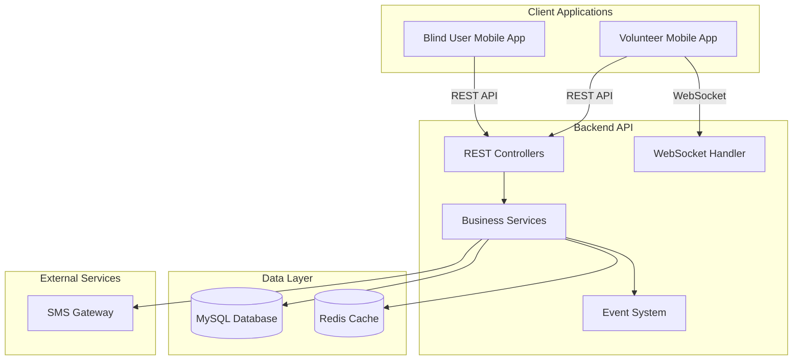
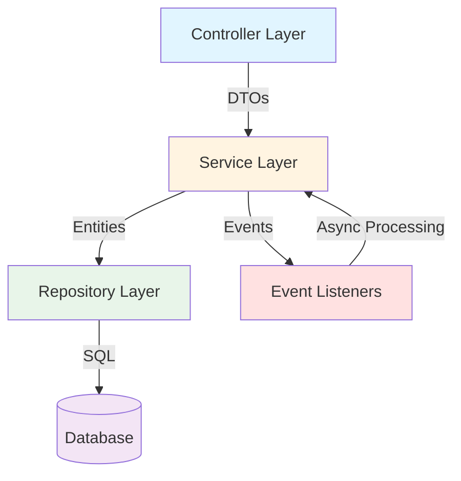
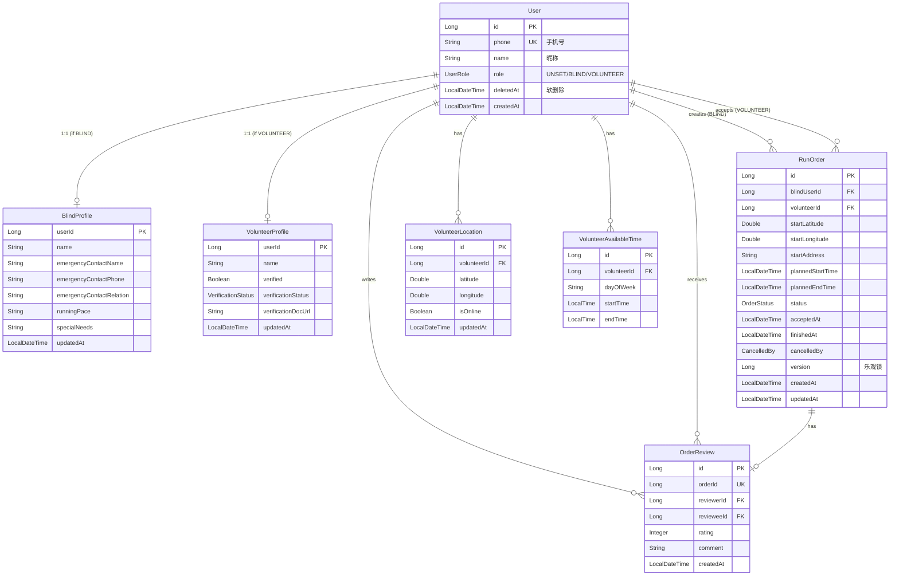
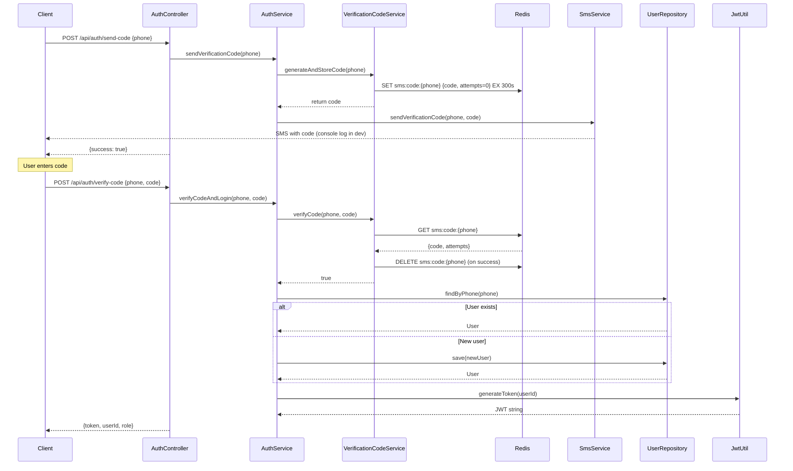
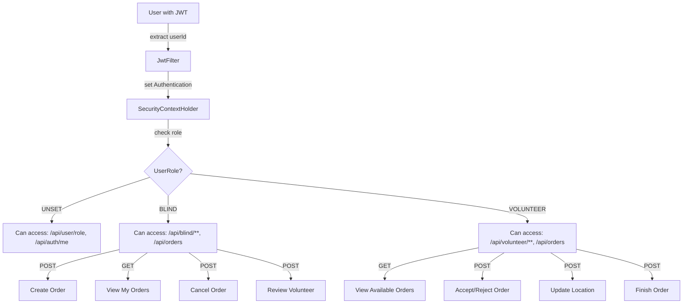
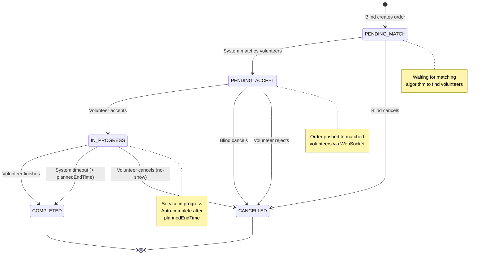
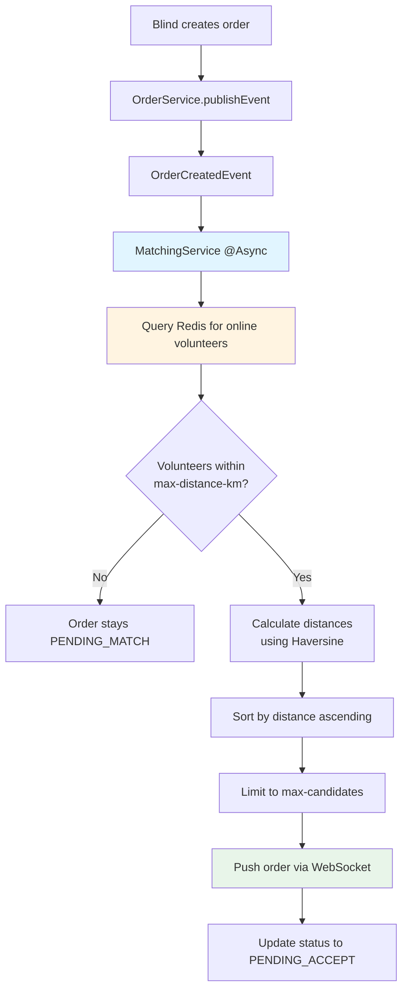
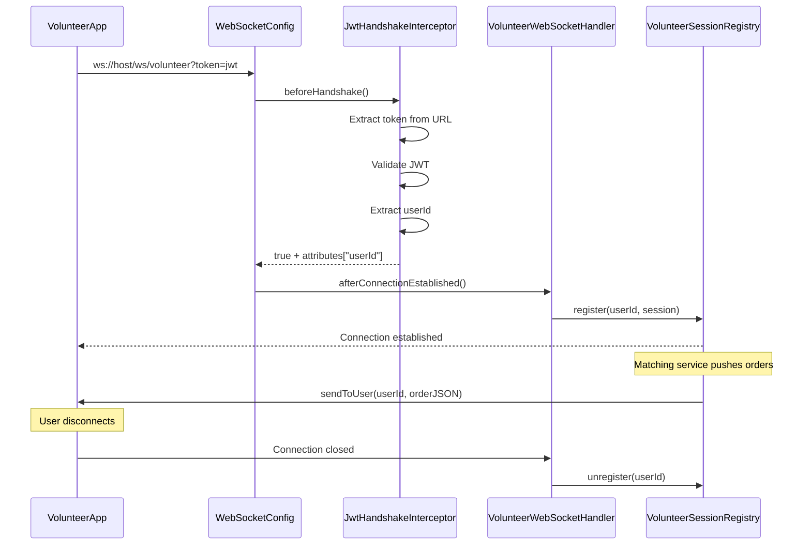
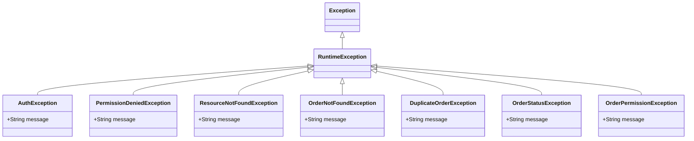
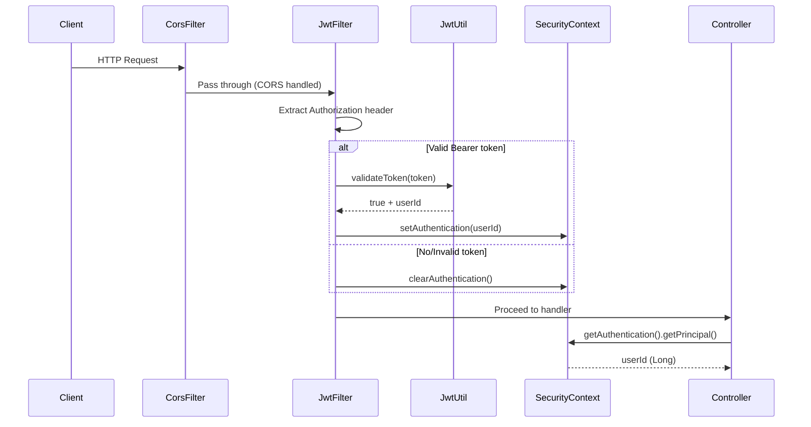

# Blind Running Companion (助盲跑) Backend - Architecture Guide

## Executive Summary

The **Blind Running Companion** is a Spring Boot-based backend service that connects visually impaired individuals (blind users) with volunteer running companions. The system facilitates real-time matching, order management, and coordination through a RESTful API with WebSocket support for live notifications.

### Key Features
- **SMS-based Authentication**: Phone number verification with time-limited codes
- **Real-time Matching**: Geolocation-based volunteer selection using Redis caching
- **Order Lifecycle Management**: State machine-driven order processing
- **WebSocket Notifications**: Live push notifications for order assignments
- **Role-based Access Control**: Blind users and volunteers with distinct workflows
- **Review System**: Post-service rating and feedback

### Technology Stack
- **Framework**: Spring Boot 3.4.4, Java 17
- **Database**: MySQL with JPA/Hibernate ORM
- **Caching**: Redis for session management and geolocation data
- **Authentication**: JWT (JSON Web Tokens) with custom filter chain
- **Real-time Communication**: WebSocket (Spring WebSocket)
- **Build Tool**: Gradle
- **API Documentation**: RESTful endpoints with DTO pattern

---

## Table of Contents

1. [System Overview](#system-overview)
2. [Architecture Layers](#architecture-layers)
3. [Data Model](#data-model)
4. [Authentication & Authorization](#authentication--authorization)
5. [Order Lifecycle](#order-lifecycle)
6. [Real-time Matching System](#real-time-matching-system)
7. [WebSocket Communication](#websocket-communication)
8. [Location Services](#location-services)
9. [Scheduled Tasks](#scheduled-tasks)
10. [Error Handling](#error-handling)
11. [Security Model](#security-model)
12. [Key Design Decisions](#key-design-decisions)
13. [Configuration Management](#configuration-management)
14. [API Endpoint Reference](#api-endpoint-reference)

---

## System Overview

### System Purpose

The Blind Running Companion platform serves two primary user types:

1. **Blind Users**: Create running orders specifying location, time, and special requirements
2. **Volunteer Companions**: Receive order notifications, accept orders, and provide accompaniment

### System Boundaries



---

## Architecture Layers

### Layered Architecture Pattern

The system follows a classic four-tier architecture with clear separation of concerns:



### Layer Responsibilities

#### 1. Controller Layer (`controller/`)
- **Purpose**: Handle HTTP requests and responses
- **Key Components**:
  - `AuthController`: SMS verification and JWT issuance
  - `OrderController`: Order CRUD operations
  - `BlindController`: Blind user profile management
  - `VolunteerController`: Volunteer profile and location updates
  - `ReviewController`: Order reviews and ratings

**Design Pattern**: Each controller uses constructor injection and extracts user ID from `SecurityContextHolder` for authorization.

#### 2. Service Layer (`service/`)
- **Purpose**: Business logic implementation and transaction management
- **Key Components**:
  - `AuthService`: Authentication flow orchestration
  - `OrderService`: Order state transitions and validation
  - `MatchingService`: Geolocation-based volunteer selection
  - `VolunteerLocationService`: Location data management with Redis caching

**Design Pattern**: Event-driven architecture with `@Async` support for non-blocking operations.

#### 3. Repository Layer (`repository/`)
- **Purpose**: Data access abstraction using Spring Data JPA
- **Key Features**:
  - Automatic CRUD operations
  - Custom query methods with JOIN FETCH for lazy loading optimization
  - Optimistic locking support via `@Version`

#### 4. Entity Layer (`entity/`)
- **Purpose**: Database table mapping with JPA annotations
- **Key Features**:
  - Automatic timestamp management via `@PrePersist` and `@PreUpdate`
  - Soft delete support
  - Enum-based status management

---

## Data Model

### Entity Relationship Diagram



### Entity Descriptions

#### User
**Purpose**: Central user account with role-based profile associations

**Key Design Decisions**:
- **Soft Delete**: `deletedAt` field allows account recovery
- **Role Enum**: `UserRole.UNSET` for new users, immutable after selection
- **Phone as ID**: Used for SMS authentication (more accessible than email for blind users)

#### RunOrder
**Purpose**: Core business entity representing a running accompaniment request

**Key Fields**:
- **Location**: GPS coordinates + human-readable address
- **Status Machine**: `PENDING_MATCH → PENDING_ACCEPT → IN_PROGRESS → COMPLETED/CANCELLED`
- **Optimistic Locking**: `@Version` prevents concurrent acceptance conflicts
- **Cancellation Tracking**: `CancelledBy` enum records who cancelled and when

#### BlindProfile & VolunteerProfile
**Purpose**: Role-specific extended profiles using `@MapsId` strategy

**Key Design Decision**: `@MapsId` shares primary key with User, enabling:
- Direct profile access via user ID
- Efficient JOIN queries
- Automatic cascade deletion

#### VolunteerLocation
**Purpose**: Real-time location caching for proximity matching

**Dual-Write Strategy**:
1. **MySQL**: Persistent storage for analytics and fallback
2. **Redis**: Fast access with 30-second TTL for online detection

#### OrderReview
**Purpose**: Post-service feedback with one-review-per-order constraint

**Constraints**:
- `orderId` is unique (one review per order)
- Rating range: 1-5 stars
- Only blind users can review volunteers

---

## Authentication & Authorization

### Authentication Flow



### JWT Token Structure

**Payload Format**:
```json
{
  "subject": "1234567890",
  "issuedAt": "2025-04-10T10:00:00Z",
  "expiration": "2025-04-11T10:00:00Z"
}
```

**Token Lifecycle**:
1. **Generation**: On successful SMS verification
2. **Storage**: Client-side (mobile app secure storage)
3. **Transmission**: `Authorization: Bearer <token>` header
4. **Validation**: `JwtFilter` on every request (except `/api/auth/**`)
5. **Expiration**: 24 hours (configurable via `jwt.expiration`)

### Authorization Model

#### Role-Based Access Control



#### Endpoint Authorization Matrix

| Endpoint | UNSET | BLIND | VOLUNTEER |
|----------|-------|-------|-----------|
| `/api/auth/**` | ✓ | ✓ | ✓ |
| `/api/user/role` | ✓ | ✗ | ✗ |
| `/api/blind/**` | ✗ | ✓ | ✗ |
| `/api/volunteer/**` | ✗ | ✗ | ✓ |
| `/api/orders` (POST) | ✗ | ✓ | ✗ |
| `/api/orders/{id}/accept` | ✗ | ✗ | ✓ |
| `/api/orders/{id}/finish` | ✗ | ✗ | ✓ |

#### Permission Checks

**Service-Level Authorization**:
```java
// Example from OrderService.acceptOrder()
VolunteerProfile profile = volunteerProfileRepository.findByUserId(volunteerId)
    .orElseThrow(() -> new OrderPermissionException("请先完成志愿者认证"));

if (!Boolean.TRUE.equals(profile.getVerified())) {
    throw new OrderPermissionException("请先完成志愿者认证");
}
```

**Resource-Level Authorization**:
```java
// Example from OrderService.cancelOrder()
boolean isBlind = order.getBlindUser().getId().equals(userId);
boolean isVolunteer = order.getVolunteer() != null && order.getVolunteer().getId().equals(userId);

if (!isBlind && !isVolunteer) {
    throw new OrderPermissionException("您无权操作此订单");
}
```

---

## Order Lifecycle

### State Machine



### State Transition Rules

#### PENDING_MATCH
**Entry**: Order creation
**Valid Transitions**:
- → `PENDING_ACCEPT`: Matching service finds eligible volunteers
- → `CANCELLED`: Blind user cancels before matching

**Business Rules**:
- No active orders allowed for blind user
- `plannedStartTime` must be in future
- `plannedEndTime` must be after `plannedStartTime`

#### PENDING_ACCEPT
**Entry**: Matching service pushes order to volunteers
**Valid Transitions**:
- → `IN_PROGRESS`: First volunteer to accept wins (optimistic locking)
- → `CANCELLED`: Blind cancels OR all volunteers reject

**Business Rules**:
- Volunteer must be verified (`verified = true`)
- Optimistic locking prevents double-acceptance
- WebSocket notification sent to matched volunteers

#### IN_PROGRESS
**Entry**: Volunteer accepts order
**Valid Transitions**:
- → `COMPLETED`: Volunteer clicks finish OR system timeout
- → `CANCELLED`: Volunteer cancels (recorded as no-show)

**Business Rules**:
- Only accepting volunteer can finish
- System auto-completes after `plannedEndTime` (60-second check interval)
- Blind user cannot cancel in this state

#### COMPLETED
**Entry**: Service finished
**Post-Completion**:
- Review enabled for blind user
- Order archived in history
- Volunteer can view review

#### CANCELLED
**Entry**: Any user cancellation
**Metadata**:
- `cancelledBy`: `BLIND` or `VOLUNTEER`
- Cancellation time tracked via `updatedAt`

**Cancellation Rules**:
| State | Blind Can Cancel? | Volunteer Can Cancel? |
|-------|------------------|----------------------|
| PENDING_MATCH | ✓ | ✗ |
| PENDING_ACCEPT | ✓ | ✓ |
| IN_PROGRESS | ✗ | ✓ (no-show) |
| COMPLETED | ✗ | ✗ |
| CANCELLED | ✗ | ✗ |

---

## Real-time Matching System

### Matching Algorithm



### Event-Driven Architecture

**OrderCreatedEvent**:
```java
public class OrderCreatedEvent extends ApplicationEvent {
    private final RunOrder order;
}
```

**Event Publisher** (OrderService):
```java
@Transactional
public OrderResponse createOrder(Long blindUserId, CreateOrderRequest request) {
    // ... validation and order creation ...
    RunOrder savedOrder = runOrderRepository.save(order);

    // Publish event for async matching
    eventPublisher.publishEvent(new OrderCreatedEvent(this, savedOrder));

    return new OrderResponse(savedOrder.getId(), savedOrder.getStatus(), "订单已提交，正在匹配志愿者");
}
```

**Event Listener** (MatchingService):
```java
@EventListener
@Async
public void handleOrderCreated(OrderCreatedEvent event) {
    // Async matching logic
    // Reload order with JOIN FETCH to avoid LazyInitializationException
    RunOrder order = runOrderRepository.findByIdWithBlindUser(event.getOrder().getId())
        .orElse(null);

    // ... matching algorithm ...
}
```

### Geolocation Matching

**Distance Calculation** (Haversine Formula):
```java
public static double distanceKm(double lat1, double lng1, double lat2, double lng2) {
    double lat1Rad = Math.toRadians(lat1);
    double lat2Rad = Math.toRadians(lat2);
    double deltaLat = Math.toRadians(lat2 - lat1);
    double deltaLng = Math.toRadians(lng2 - lng1);

    double a = Math.sin(deltaLat / 2) * Math.sin(deltaLat / 2)
            + Math.cos(lat1Rad) * Math.cos(lat2Rad)
            * Math.sin(deltaLng / 2) * Math.sin(deltaLng / 2);

    double c = 2 * Math.atan2(Math.sqrt(a), Math.sqrt(1 - a));

    return EARTH_RADIUS_KM * c;  // 6371.0 km
}
```

**Matching Criteria**:
1. **Distance**: ≤ `app.matching.max-distance-km` (default: 10km)
2. **Online Status**: Volunteer location in Redis with TTL < 30s
3. **Verification**: Volunteer must have `verified = true`
4. **Sorting**: By distance (closest first)
5. **Limit**: Top `app.matching.max-candidates` (default: 3)

---

## WebSocket Communication

### Connection Lifecycle



### WebSocket Configuration

**Endpoint**: `ws://localhost:8081/ws/volunteer?token=<jwt>`

**Handler**: `VolunteerWebSocketHandler extends TextWebSocketHandler`

**Interceptor**: `JwtHandshakeInterceptor`
- Validates JWT token from URL query parameter
- Extracts `userId` and stores in session attributes
- Returns `false` to reject invalid tokens

### Message Format

**Order Push Notification**:
```json
{
  "type": "NEW_ORDER",
  "orderId": 1001,
  "blindUserPhone": "138****1234",
  "startAddress": "朝阳公园南门",
  "distanceKm": 1.8,
  "plannedStart": "2025-04-02T18:00:00",
  "plannedEnd": "2025-04-02T19:00:00"
}
```

**Message Sending**:
```java
public void sendToUser(Long volunteerId, String message) {
    Optional<WebSocketSession> sessionOpt = getSession(volunteerId);
    if (sessionOpt.isEmpty()) {
        log.warn("志愿者 {} 未连接 WebSocket，无法推送消息", volunteerId);
        return;
    }

    WebSocketSession session = sessionOpt.get();
    if (!session.isOpen()) {
        unregister(volunteerId);
        return;
    }

    try {
        session.sendMessage(new TextMessage(message));
        log.debug("已向志愿者 {} 推送消息", volunteerId);
    } catch (IOException e) {
        log.warn("推送失败，移除注册: {}", e.getMessage());
        unregister(volunteerId);
    }
}
```

### Session Management

**Registry**: `VolunteerSessionRegistry`
- **Data Structure**: `ConcurrentHashMap<Long, WebSocketSession>`
- **Thread Safety**: Handles concurrent connect/disconnect
- **Connection Deduplication**: Closes old session when volunteer reconnects
- **Auto-Cleanup**: Removes sessions on send failure

---

## Location Services

### Dual-Write Architecture

```mermaid
graph LR
    A[VolunteerApp<br/>POST /location] --> B[VolunteerLocationService]
    B --> C[MySQL<br/>volunteer_location table]
    B --> D[Redis<br/>vol:loc:{userId}]

    C -->|Persistent| E[Analytics & Fallback]
    D -->|Fast Access| F[Matching Algorithm]

    D -->|TTL 30s| G[Auto-Expire<br/>→ Offline]
```

### Redis Data Structure

**Key Format**: `vol:loc:{userId}`

**Value Format**: JSON
```json
{
  "userId": 1234567890,
  "lat": 39.9042,
  "lng": 116.4074,
  "isOnline": true,
  "updatedAt": 1712808000000
}
```

**TTL**: 30 seconds (`app.volunteer.location-ttl-seconds`)

**Automatic Expiration**: Volunteer considered offline if no update within 30s

### Location Update Flow

**Request**:
```http
POST /api/volunteer/location
Authorization: Bearer <token>
Content-Type: application/json

{
  "latitude": 39.9042,
  "longitude": 116.4074,
  "isOnline": true
}
```

**Processing**:
```java
public void updateLocation(Long userId, Double latitude, Double longitude, Boolean isOnline) {
    // 1. UPSERT to MySQL
    VolunteerLocation location = locationRepository.findByVolunteerId(userId)
        .orElseGet(() -> createNewLocation(userId));
    location.setLatitude(latitude);
    location.setLongitude(longitude);
    location.setIsOnline(isOnline != null ? isOnline : true);
    location.setUpdatedAt(LocalDateTime.now());
    locationRepository.save(location);

    // 2. Write to Redis with TTL
    String key = REDIS_KEY_PREFIX + userId;
    Map<String, Object> value = Map.of(
        "userId", userId,
        "lat", latitude,
        "lng", longitude,
        "isOnline", isOnline,
        "updatedAt", System.currentTimeMillis()
    );
    String json = objectMapper.writeValueAsString(value);
    redisTemplate.opsForValue().set(key, json, locationTtlSeconds, TimeUnit.SECONDS);
}
```

### Query Strategy

**Priority**: Redis → Database Fallback

```java
public List<Map<String, Object>> getOnlineVolunteerLocations() {
    // 1. Try Redis first (fast)
    Set<String> keys = redisTemplate.keys(REDIS_KEY_PREFIX + "*");
    if (keys != null && !keys.isEmpty()) {
        List<Map<String, Object>> result = parseRedisEntries(keys);
        if (!result.isEmpty()) {
            return result;  // Return from cache
        }
    }

    // 2. Fallback to database (slow but reliable)
    log.info("Redis 无在线志愿者数据，降级查询数据库");
    List<VolunteerLocation> dbLocations = locationRepository.findByIsOnlineTrue();
    return convertToMapList(dbLocations);
}
```

**Why Dual-Write?**
- **Redis Speed**: O(n) key scan for matching algorithm
- **MySQL Persistence**: Survives Redis restart, enables analytics
- **TTL-based Online Detection**: Automatic cleanup of stale data

---

## Scheduled Tasks

### Order Timeout Auto-Completion

**Scheduler**: `OrderTimeoutScheduler.autoCompleteTimedOutOrders()`

**Trigger**: Every 60 seconds (`@Scheduled(fixedRate = 60000)`)

**Purpose**: Automatically complete orders that exceed their planned end time

```java
@Scheduled(fixedRate = 60000)
@Transactional
public void autoCompleteTimedOutOrders() {
    List<RunOrder> timedOut = runOrderRepository.findTimedOutOrders(LocalDateTime.now());
    for (RunOrder order : timedOut) {
        order.setStatus(OrderStatus.COMPLETED);
        order.setFinishedAt(LocalDateTime.now());
        log.info("订单 {} 超过计划结束时间，系统自动完成", order.getId());
    }
    if (!timedOut.isEmpty()) {
        runOrderRepository.saveAll(timedOut);
    }
}
```

**Repository Query**:
```java
@Query("SELECT o FROM RunOrder o WHERE o.status = 'IN_PROGRESS' AND o.plannedEndTime < :currentTime")
List<RunOrder> findTimedOutOrders(@Param("currentTime") LocalDateTime currentTime);
```

**Use Cases**:
- Volunteer forgets to click finish
- App crashes during service
- Emergency situations

**Configuration**: Requires `@EnableScheduling` on main application class

---

## Error Handling

### Exception Hierarchy



### Response Format Standards

**Legacy Format** (Authentication & User Management):
```json
{
  "error": "错误信息"
}
```

**Modern Format** (Order & Volunteer Operations):
```json
{
  "success": false,
  "code": 409,
  "message": "订单已被其他志愿者接单"
}
```

### HTTP Status Code Mapping

| Exception | HTTP Status | Use Case |
|-----------|-------------|----------|
| `AuthException` | 400 | Invalid verification code |
| `ResourceNotFoundException` | 404 | Profile not found |
| `OrderNotFoundException` | 404 | Order doesn't exist |
| `OrderPermissionException` | 403 | Unauthorized order access |
| `PermissionDeniedException` | 403 | Wrong role for endpoint |
| `DuplicateOrderException` | 409 | Active order exists |
| `OrderStatusException` | 409 | Invalid state transition |
| `RoleAlreadySetException` | 409 | Role already set |
| `OptimisticLockingFailureException` | 409 | Concurrent order acceptance |
| `MethodArgumentNotValidException` | 400 | @Valid validation fails |
| `IllegalArgumentException` | 400 | Business logic violation |
| `Exception` (catch-all) | 500 | Internal server error |

### Global Exception Handler

**Decorator**: `@RestControllerAdvice`

**Example Handlers**:
```java
@ExceptionHandler(OrderStatusException.class)
public ResponseEntity<Map<String, Object>> handleOrderStatus(OrderStatusException e) {
    return ResponseEntity
        .status(HttpStatus.CONFLICT)
        .body(Map.of("success", false, "code", 409, "message", e.getMessage()));
}

@ExceptionHandler(OptimisticLockingFailureException.class)
public ResponseEntity<Map<String, Object>> handleOptimisticLock(OptimisticLockingFailureException e) {
    return ResponseEntity
        .status(HttpStatus.CONFLICT)
        .body(Map.of("success", false, "code", 409, "message", "订单已被其他志愿者接单"));
}
```

---

## Security Model

### Security Filter Chain



### Security Configuration

**Key Settings**:
- **Session Management**: `STATELESS` (no server-side sessions)
- **CSRF**: Disabled (JWT tokens are immune)
- **CORS**: Enabled for all origins/methods/headers
- **Unauthenticated Response**: 401 (not 403)

**Public Endpoints**:
```java
.requestMatchers("/api/auth/**").permitAll()  // SMS verification
.requestMatchers("/ws/volunteer/**").permitAll()  // WebSocket (auth in interceptor)
```

**Protected Endpoints**:
```java
.anyRequest().authenticated()  // Requires valid JWT
```

### JWT Implementation

**Token Generation**:
```java
public String generateToken(Long userId) {
    return Jwts.builder()
        .subject(String.valueOf(userId))  // Subject = user ID
        .issuedAt(new Date())             // Issued at = now
        .expiration(new Date(System.currentTimeMillis() + expiration))  // 24h expiry
        .signWith(getSigningKey())        // HMAC-SHA256
        .compact();
}
```

**Token Validation**:
```java
public boolean validateToken(String token) {
    try {
        Jwts.parser()
            .verifyWith(getSigningKey())
            .build()
            .parseSignedClaims(token);
        return true;
    } catch (JwtException | IllegalArgumentException e) {
        return false;
    }
}
```

**Key Management**:
- **Secret**: Configurable via `jwt.secret` (default: 256-bit random string)
- **Algorithm**: HMAC-SHA256
- **Storage**: Client-side (Authorization header)

### WebSocket Authentication

**Challenge**: WebSocket protocol doesn't support custom headers

**Solution**: JWT token in URL query parameter

```
ws://localhost:8081/ws/volunteer?token=<jwt>
```

**Interceptor Logic**:
```java
@Override
public boolean beforeHandshake(ServerHttpRequest request, ServerHttpResponse response,
                                WebSocketHandler wsHandler, Map<String, Object> attributes) {
    String query = request.getURI().getQuery();
    String token = extractTokenFromQuery(query);

    if (!jwtUtil.validateToken(token)) {
        return false;  // Reject connection
    }

    Long userId = jwtUtil.getUserIdFromToken(token);
    attributes.put("userId", userId);  // Pass to handler
    return true;
}
```

---

## Key Design Decisions

### 1. MapsId Strategy for Profiles

**Decision**: Use `@MapsId` for BlindProfile and VolunteerProfile

**Rationale**:
- **Shared Primary Key**: Profile ID = User ID (no foreign key column)
- **Direct Access**: `repository.findByUserId(userId)` without JOIN
- **Automatic Cleanup**: Deleting User cascades to Profile
- **Type Safety**: One-to-one relationship enforced at database level

**Implementation**:
```java
@Entity
public class BlindProfile {
    @Id
    private Long userId;  // Same as User.id

    @OneToOne(fetch = FetchType.LAZY)
    @MapsId  // Shares primary key with User
    @JoinColumn(name = "user_id")
    private User user;
}
```

### 2. Optimistic Locking for Orders

**Decision**: Use `@Version` field on RunOrder entity

**Rationale**:
- **Prevent Double-Acceptance**: Two volunteers accepting simultaneously
- **Database-Level Protection**: Hibernate checks version on update
- **Automatic Conflict Detection**: Throws `OptimisticLockingFailureException`
- **User-Friendly Error**: "Order already accepted" message

**How It Works**:
```java
@Entity
public class RunOrder {
    @Version
    private Long version;  // Increments on each update
}

// Volunteer A and Volunteer B both read version=0
// Volunteer A updates → version becomes 1, success
// Volunteer B updates → version mismatch → 409 Conflict
```

### 3. Event-Driven Matching

**Decision**: Use Spring Events with @Async for matching

**Rationale**:
- **Non-Blocking UX**: User gets immediate 201 response
- **Decoupling**: OrderService doesn't know about MatchingService
- **Extensibility**: Add new event listeners without changing OrderService
- **Error Isolation**: Matching failure doesn't affect order creation

**Alternative Considered**: Direct method call
- **Rejected**: Would slow down order creation response
- **Rejected**: Tight coupling between services

### 4. Redis + MySQL Dual Write

**Decision**: Store volunteer locations in both Redis and MySQL

**Rationale**:
| Aspect | Redis | MySQL |
|--------|-------|-------|
| **Read Speed** | O(1) key access | O(n) query |
| **Persistence** | Volatile | Durable |
| **Online Detection** | TTL-based auto-cleanup | Manual timestamp check |
| **Analytics** | Limited | Full SQL support |

**Trade-offs**:
- **Pros**: Fast matching + reliable persistence + automatic online detection
- **Cons**: Dual write complexity (mitigated by logging)

### 5. Phone-Based Authentication

**Decision**: SMS verification codes instead of passwords

**Rationale**:
- **Accessibility**: Voice assistants can read SMS codes
- **Security**: No password storage, no credential stuffing
- **Simplicity**: No password reset flow needed
- **Mobile-First**: Fits target user behavior

**Implementation Details**:
- **Code Length**: 6 digits (configurable)
- **TTL**: 5 minutes
- **Max Attempts**: 5 (then code expires)
- **Development**: Console log instead of real SMS

### 6. Enum-Based Status Management

**Decision**: Use enums for OrderStatus, UserRole, etc.

**Rationale**:
- **Type Safety**: Compiler checks valid values
- **Readability**: `OrderStatus.IN_PROGRESS` vs integer 2
- **Database Storage**: `@Enumerated(STRING)` stores readable values
- **Extensibility**: Add new states without changing database schema

**Example**:
```java
public enum OrderStatus {
    PENDING_MATCH,      // Database stores "PENDING_MATCH"
    PENDING_ACCEPT,     // Not 0, 1, 2...
    IN_PROGRESS,
    COMPLETED,
    CANCELLED
}
```

### 7. Soft Delete Pattern

**Decision**: Use `deletedAt` timestamp instead of hard deletes

**Rationale**:
- **Data Recovery**: Can restore accidentally deleted accounts
- **Audit Trail**: Preserve historical data
- **Referential Integrity**: Avoid foreign key violations
- **Compliance**: Meet data retention requirements

**Implementation**:
```java
@Column(name = "deleted_at")
private LocalDateTime deletedAt;

// Soft delete
user.setDeletedAt(LocalDateTime.now());
userRepository.save(user);

// Query excludes deleted
@Query("SELECT u FROM User u WHERE u.deletedAt IS NULL")
```

---

## Configuration Management

### Application Properties Structure

```properties
# Server Configuration
server.port=8081
spring.application.name=demo

# Database
spring.datasource.url=jdbc:mysql://localhost:3306/spring_demo
spring.datasource.username=root
spring.datasource.password=
spring.jpa.hibernate.ddl-auto=update
spring.jpa.show-sql=true

# Redis
spring.data.redis.host=localhost
spring.data.redis.port=6379

# JWT
jwt.secret=mySecretKeyForJwtTokenGenerationThatShouldBeAtLeast256BitsLong
jwt.expiration=86400000

# SMS Verification
sms.code.length=6
sms.code.ttl-minutes=5
sms.code.max-attempts=5

# Matching Algorithm
app.matching.max-distance-km=10
app.matching.max-candidates=3

# WebSocket
app.websocket.endpoint=/ws/volunteer

# Volunteer Location
app.volunteer.location-ttl-seconds=30

# File Upload
spring.servlet.multipart.max-file-size=10MB
app.upload.dir=uploads/
```

### Configuration Hierarchy

**Prefix Convention**: `app.*` for application-specific config

**Environment-Specific Overrides**:
- `application.properties` (default)
- `application-dev.properties` (development)
- `application-prod.properties` (production)

**Example Override**:
```properties
# application-dev.properties
app.matching.max-distance-km=50  # Larger radius for testing
sms.code.ttl-minutes=60          # Longer expiry for debugging
```

### Bean Configuration

**Constructor Injection** (preferred):
```java
@Service
public class OrderService {
    private final RunOrderRepository runOrderRepository;
    private final ApplicationEventPublisher eventPublisher;

    public OrderService(RunOrderRepository runOrderRepository,
                        ApplicationEventPublisher eventPublisher) {
        this.runOrderRepository = runOrderRepository;
        this.eventPublisher = eventPublisher;
    }
}
```

**Benefits**:
- **Immutability**: Final fields can't be changed
- **Testability**: Easy to mock dependencies
- **Null Safety**: Constructor enforces non-null dependencies

---

## API Endpoint Reference

### Authentication Endpoints

#### Send Verification Code
```http
POST /api/auth/send-code
Content-Type: application/json

{
  "phone": "13800138000"
}

Response 200:
{
  "success": true
}
```

#### Verify Code & Login
```http
POST /api/auth/verify-code
Content-Type: application/json

{
  "phone": "13800138000",
  "code": "123456"
}

Response 200:
{
  "token": "eyJhbGciOiJIUzI1NiIsInR5cCI6IkpXVCJ9...",
  "userId": 1234567890,
  "role": "UNSET"
}
```

#### Get Current User
```http
GET /api/auth/me
Authorization: Bearer <token>

Response 200:
{
  "userId": 1234567890,
  "phone": "138****8000",
  "role": "BLIND",
  "createdAt": "2025-04-01T10:00:00"
}
```

### User Management Endpoints

#### Set User Role
```http
POST /api/user/role
Authorization: Bearer <token>
Content-Type: application/json

{
  "role": "BLIND"  // or "VOLUNTEER"
}

Response 200:
{
  "success": true,
  "role": "BLIND"
}

Response 409 (if already set):
{
  "success": false,
  "code": 409,
  "message": "身份已设定，不可修改"
}
```

#### Get User Info
```http
GET /api/users/{id}
Authorization: Bearer <token>

Response 200:
{
  "id": 1234567890,
  "phone": "138****8000",
  "role": "BLIND",
  "createdAt": "2025-04-01T10:00:00"
}
```

#### Delete Account
```http
DELETE /api/users/{id}
Authorization: Bearer <token>

Response 200:
{
  "success": true
}
```

### Blind Profile Endpoints

#### Get Profile
```http
GET /api/blind/profile
Authorization: Bearer <token>

Response 200:
{
  "name": "张三",
  "emergencyContactName": "李四",
  "emergencyContactPhone": "139****0000",
  "emergencyContactRelation": "配偶",
  "runningPace": "6:00/km",
  "specialNeeds": "需要语音提醒"
}
```

#### Update Profile
```http
PUT /api/blind/profile
Authorization: Bearer <token>
Content-Type: application/json

{
  "name": "张三",
  "emergencyContactName": "李四",
  "emergencyContactPhone": "13900000000",
  "emergencyContactRelation": "配偶",
  "runningPace": "6:00/km",
  "specialNeeds": "需要语音提醒"
}

Response 200:
{
  "success": true,
  "data": { /* profile object */ }
}
```

### Volunteer Profile Endpoints

#### Get Profile
```http
GET /api/volunteer/profile
Authorization: Bearer <token>

Response 200:
{
  "name": "王五",
  "verificationStatus": "APPROVED",
  "availableTimeSlots": [
    {
      "dayOfWeek": "MONDAY",
      "startTime": "18:00:00",
      "endTime": "20:00:00"
    }
  ]
}
```

#### Update Profile
```http
PUT /api/volunteer/profile
Authorization: Bearer <token>
Content-Type: application/json

{
  "name": "王五",
  "availableTimeSlots": [
    {
      "dayOfWeek": "MONDAY",
      "startTime": "18:00:00",
      "endTime": "20:00:00"
    }
  ]
}

Response 200:
{
  "success": true,
  "data": { /* profile object */ }
}
```

#### Submit Verification Document
```http
POST /api/volunteer/verification
Authorization: Bearer <token>
Content-Type: multipart/form-data

file: <binary>

Response 200:
{
  "success": true,
  "status": "APPROVED"
}
```

#### Get Verification Status
```http
GET /api/volunteer/verification/status
Authorization: Bearer <token>

Response 200:
{
  "status": "APPROVED"
}
```

#### Update Location
```http
POST /api/volunteer/location
Authorization: Bearer <token>
Content-Type: application/json

{
  "latitude": 39.9042,
  "longitude": 116.4074,
  "isOnline": true
}

Response 200:
{
  "success": true
}
```

### Order Endpoints

#### Create Order
```http
POST /api/orders
Authorization: Bearer <token>
Content-Type: application/json

{
  "startLatitude": 39.9042,
  "startLongitude": 116.4074,
  "startAddress": "朝阳公园南门",
  "plannedStartTime": "2025-04-02T18:00:00",
  "plannedEndTime": "2025-04-02T19:00:00"
}

Response 201:
{
  "orderId": 1001,
  "status": "PENDING_MATCH",
  "message": "订单已提交，正在匹配志愿者"
}
```

#### Accept Order
```http
POST /api/orders/{id}/accept
Authorization: Bearer <token>

Response 200:
{
  "success": true,
  "orderId": 1001
}

Response 409 (concurrent acceptance):
{
  "success": false,
  "code": 409,
  "message": "订单已被其他志愿者接单"
}
```

#### Reject Order
```http
POST /api/orders/{id}/reject
Authorization: Bearer <token>

Response 200:
{
  "success": true
}
```

#### Finish Order
```http
POST /api/orders/{id}/finish
Authorization: Bearer <token>

Response 200:
{
  "success": true,
  "orderId": 1001
}
```

#### Cancel Order
```http
POST /api/orders/{id}/cancel
Authorization: Bearer <token>

Response 200:
{
  "success": true
}
```

#### Get Available Orders (Volunteer)
```http
GET /api/orders/available
Authorization: Bearer <token>

Response 200:
[
  {
    "orderId": 1001,
    "startAddress": "朝阳公园南门",
    "distanceKm": 1.8,
    "plannedStart": "2025-04-02T18:00:00",
    "plannedEnd": "2025-04-02T19:00:00",
    "blindUserPhone": "138****1234"
  }
]
```

#### Get Order Details
```http
GET /api/orders/{id}
Authorization: Bearer <token>

Response 200:
{
  "orderId": 1001,
  "status": "IN_PROGRESS",
  "startAddress": "朝阳公园南门",
  "plannedStartTime": "2025-04-02T18:00:00",
  "plannedEndTime": "2025-04-02T19:00:00",
  "volunteerPhone": "139****5678",
  "acceptedAt": "2025-04-02T17:55:00",
  "createdAt": "2025-04-02T17:50:00"
}
```

#### Get My Orders
```http
GET /api/orders/mine?role=BLIND&status=IN_PROGRESS&page=0&size=10
Authorization: Bearer <token>

Response 200:
{
  "content": [ /* orders */ ],
  "pageable": {
    "pageNumber": 0,
    "pageSize": 10,
    "totalElements": 5,
    "totalPages": 1
  }
}
```

### Review Endpoints

#### Create Review
```http
POST /api/orders/{id}/review
Authorization: Bearer <token>
Content-Type: application/json

{
  "rating": 5,
  "comment": "志愿者很耐心，体验很好！"
}

Response 201:
{
  "success": true
}
```

#### Get Review
```http
GET /api/orders/{id}/reviews
Authorization: Bearer <token>

Response 200:
{
  "data": {
    "orderId": 1001,
    "rating": 5,
    "comment": "志愿者很耐心，体验很好！",
    "createdAt": "2025-04-02T19:30:00"
  }
}
```

---

## Appendix A: Utility Classes

### PhoneMaskUtils
**Purpose**: Mask phone numbers for privacy

**Implementation**:
```java
public class PhoneMaskUtils {
    public static String mask(String phone) {
        if (phone == null || phone.length() < 7) return phone;
        return phone.substring(0, 3) + "****" + phone.substring(phone.length() - 4);
    }
}
```

**Usage**: `138****1234` (first 3 + last 4 digits visible)

### GeoUtils
**Purpose**: Calculate distance between GPS coordinates

**Algorithm**: Haversine formula for great-circle distance

**Implementation**:
```java
public static double distanceKm(double lat1, double lng1, double lat2, double lng2) {
    double lat1Rad = Math.toRadians(lat1);
    double lat2Rad = Math.toRadians(lat2);
    double deltaLat = Math.toRadians(lat2 - lat1);
    double deltaLng = Math.toRadians(lng2 - lng1);

    double a = Math.sin(deltaLat / 2) * Math.sin(deltaLat / 2)
            + Math.cos(lat1Rad) * Math.cos(lat2Rad)
            * Math.sin(deltaLng / 2) * Math.sin(deltaLng / 2);

    double c = 2 * Math.atan2(Math.sqrt(a), Math.sqrt(1 - a));

    return EARTH_RADIUS_KM * c;  // 6371.0 km
}
```

---

## Appendix B: Testing Considerations

### Integration Test Setup

**Base Test Configuration**:
```java
@ExtendWith(SpringExtension.class)
@SpringBootTest(webEnvironment = RANDOM_PORT)
@Testcontainers
@DirtiesContext(classMode = AFTER_CLASS)
public abstract class BaseIntegrationTest {
    @Container
    static RedisContainer redis = new RedisContainer(DockerImageName.parse("redis:7-alpine"));

    @DynamicPropertySource
    static void configureProperties(DynamicPropertyRegistry registry) {
        registry.add("spring.data.redis.host", redis::getHost);
        registry.add("spring.data.redis.port", redis::getFirstMappedPort);
    }
}
```

**Test Isolation**:
- `@DirtiesContext`: Restart Spring context between test classes
- `@Sql(cleanup.sql)`: Clear database tables before each test
- Redis cleanup in `@BeforeEach`: Delete `vol:loc:*` keys

---

## Appendix C: Deployment Checklist

### Pre-Deployment

**Configuration**:
- [ ] Set strong JWT secret in production
- [ ] Configure production database URL
- [ ] Set appropriate CORS origins
- [ ] Adjust SMS code TTL for production
- [ ] Configure matching radius for production region
- [ ] Set up file upload directory with proper permissions

**Security**:
- [ ] Enable HTTPS/TLS
- [ ] Configure firewall rules
- [ ] Set up database backups
- [ ] Configure Redis persistence
- [ ] Enable Spring Boot actuator security

**Monitoring**:
- [ ] Set up application logging
- [ ] Configure metrics collection
- [ ] Set up health check endpoints
- [ ] Configure alerting for errors

### Post-Deployment

**Verification**:
- [ ] Test SMS delivery with real provider
- [ ] Verify WebSocket connections work through load balancer
- [ ] Test order timeout scheduler
- [ ] Verify Redis persistence
- [ ] Load test matching algorithm

---

## Conclusion

This architecture guide provides a comprehensive overview of the Blind Running Companion backend system. The design prioritizes:

1. **Accessibility**: Phone-based authentication for blind users
2. **Real-time Performance**: Event-driven matching with WebSocket notifications
3. **Data Integrity**: Optimistic locking and state machine validation
4. **Scalability**: Async processing and Redis caching
5. **Maintainability**: Clean architecture with clear separation of concerns

For questions or contributions, please refer to the project repository or contact the development team.

---

**Document Version**: 1.0
**Last Updated**: 2025-04-10
**Author**: Architecture Documentation Generator
**Framework**: Spring Boot 3.4.4 / Java 17
