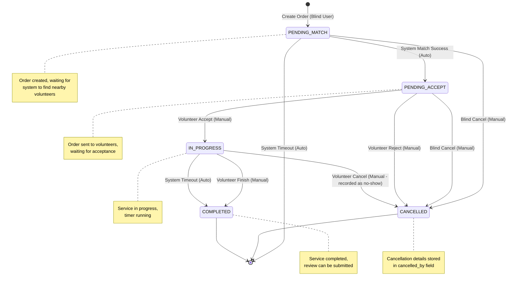
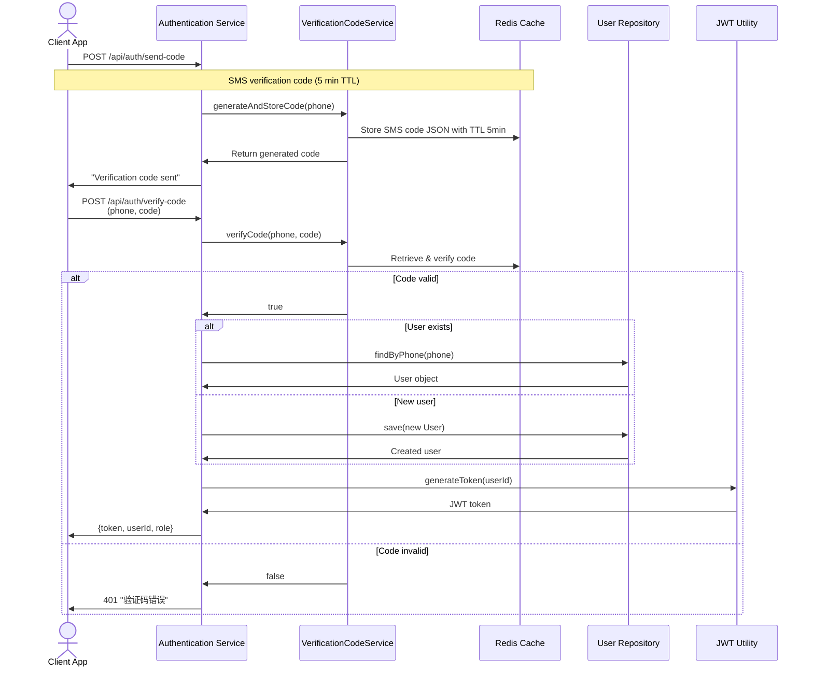
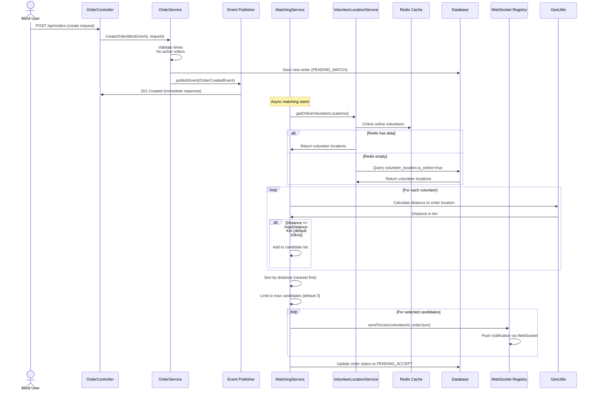
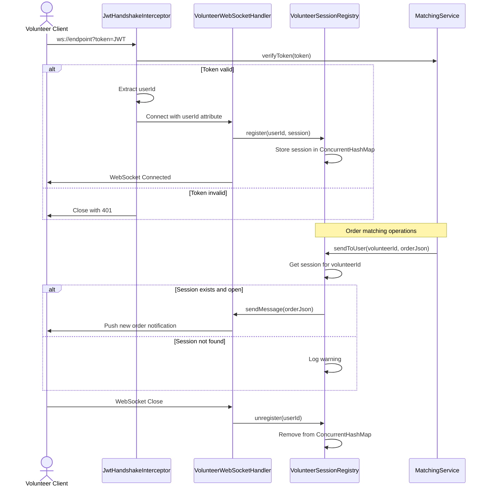

# Blind Running Companion (助盲跑) Backend - Comprehensive Mermaid Diagrams

This document contains all Mermaid diagrams for the Blind Running Companion backend system architecture, data models, and business flows.

---

## 1. Entity Relationship Diagram (erDiagram)

```mermaid
erDiagram
    USER {
        long id PK
        string name
        string phone unique
        UserRole role
        LocalDateTime deleted_at
        LocalDateTime created_at
    }
    
    BLIND_PROFILE {
        long user_id PK
        string name
        string emergency_contact_name
        string emergency_contact_phone
        string emergency_contact_relation
        string running_pace
        string special_needs
        LocalDateTime updated_at
    }
    
    VOLUNTEER_PROFILE {
        long user_id PK
        string name
        boolean verified default false
        VerificationStatus verification_status default NONE
        string verification_doc_url
        LocalDateTime updated_at
    }
    
    RUN_ORDER {
        long id PK
        long blind_user_id FK
        long volunteer_id FK
        double start_latitude
        double start_longitude
        string start_address
        LocalDateTime planned_start_time
        LocalDateTime planned_end_time
        OrderStatus status
        LocalDateTime accepted_at
        LocalDateTime finished_at
        CancelledBy cancelled_by
        LocalDateTime created_at
        LocalDateTime updated_at
        Long version
    }
    
    VOLUNTEER_LOCATION {
        long id PK
        long volunteer_id FK
        double latitude
        double longitude
        boolean is_online default false
        LocalDateTime updated_at
    }
    
    VOLUNTEER_AVAILABLE_TIME {
        long id PK
        long volunteer_id
        string day_of_week
        LocalTime start_time
        LocalTime end_time
    }
    
    ORDER_REVIEW {
        long id PK
        long order_id unique
        long reviewer_id
        long reviewee_id
        integer rating
        string comment
        LocalDateTime created_at
    }

    USER ||--o{ BLIND_PROFILE : has
    USER ||--o{ VOLUNTEER_PROFILE : has
    USER ||--o{ RUN_ORDER : creates
    USER ||--o{ RUN_ORDER : accepts_as_volunteer
    USER ||--o{ VOLUNTEER_LOCATION : reports
    USER ||--o{ VOLUNTEER_AVAILABLE_TIME : has
    RUN_ORDER ||--o{ ORDER_REVIEW : receives

    Note: All timestamps are automatically managed by JPA lifecycle callbacks (@PrePersist, @PreUpdate)
```

---

## 2. Order State Machine (stateDiagram-v2)



---

## 3. Authentication Flow (sequenceDiagram)



---

## 4. Order Matching Flow (sequenceDiagram)



---

## 5. System Architecture Overview (flowchart)

```mermaid
flowchart TD
    subgraph "Client Layer"
        A[Web/Mobile Client]
    end
    
    subgraph "API Layer (Controllers)"
        B[AuthController] --> POST /auth/send-code
        B --> POST /auth/verify-code
        B --> GET /auth/me
        C[UserController] --> POST /user/role
        D[BlindController] --> GET/PUT /blind/profile
        E[VolunteerController] --> GET/PUT /volunteer/profile<br/>POST /volunteer/location<br/>POST /volunteer/verification
        F[OrderController] --> POST /orders<br/>POST /orders/{id}/accept<br/>POST /orders/{id}/reject<br/>POST /orders/{id}/cancel<br/>POST /orders/{id}/finish<br/>GET /orders/available<br/>GET /orders/mine<br/>GET /orders/{id}
        G[ReviewController] --> POST /orders/{id}/review<br/>GET /orders/{id}/reviews
    end
    
    subgraph "Service Layer"
        H[AuthService] --> handles SMS auth
        I[OrderService] --> handles order lifecycle
        J[MatchingService] --> handles order matching
        K[VolunteerLocationService] --> handles location updates
        L[VolunteerProfileService] --> handles volunteer profiles
        M[UserService] --> handles user management
    end
    
    subgraph "Data Access Layer"
        N[UserRepository]
        O[RunOrderRepository]
        P[VolunteerLocationRepository]
        Q[VolunteerProfileRepository]
        R[VolunteerAvailableTimeRepository]
        S[OrderReviewRepository]
    end
    
    subgraph "Infrastructure"
        T[(MySQL Database)]
        U[(Redis Cache)]
        V[JWT Utility]
        W[GeoUtils]
        X[SmsService]
    end
    
    subgraph "Cross-Cutting Concerns"
        Y[GlobalExceptionHandler] --> handles exceptions
        Z[JwtFilter] --> validates JWT tokens
        AA[WebSocketRegistry] --> manages sessions
    end
    
    subgraph "Async Components"
        AB[Event Publisher] --> OrderCreatedEvent
        AC[OrderTimeoutScheduler] --> monitors timeouts
    end
    
    A --> B
    A --> C
    A --> D
    A --> E
    A --> F
    A --> G
    
    B --> H
    C --> I
    D --> M
    E --> J
    E --> K
    E --> L
    F --> I
    F --> J
    G --> I
    
    H --> N
    I --> N
    I --> O
    I --> S
    J --> K
    J --> O
    J --> AB
    K --> O
    K --> P
    K --> U
    L --> P
    M --> N
    M --> R
    
    N --> T
    O --> T
    P --> T
    Q --> T
    R --> T
    S --> T
    
    I --> V
    J --> V
    J --> W
    K --> U
    K --> T
    
    Z --> V
    AB --> J
    
    AC --> I
    AC --> O
    
    AA --> AB
    AA --> J
    
    Y --> X
    Y --> H
    
    style A fill:#f9f,stroke:#333,stroke-width:2px
    style T fill:#ccf,stroke:#333,stroke-width:2px
    style U fill:#cfc,stroke:#333,stroke-width:2px
    style AB fill:#fcf,stroke:#333,stroke-width:2px
    style AA fill:#ffc,stroke:#333,stroke-width:2px
```

---

## 6. WebSocket Connection Lifecycle (sequenceDiagram)



---

## 7. Volunteer Location Update Flow (flowchart)

```mermaid
flowchart TD
    A[POST /volunteer/location<br/>(volunteerId, lat, lng, isOnline)] --> B[Validate input]
    B --> C[Start transaction]
    C --> D[Check if location record exists]
    
    D -->|Exists| E[Update existing record]
    D -->|New| F[Create new record]
    
    E --> G[Save to database]
    F --> G[Save to database]
    
    G --> H[Prepare Redis data]
    H --> I{Redis available?}
    
    I -->|Yes| J[Write to Redis with TTL]
    I -->|No| K[Log warning, continue]
    
    J --> L[Set TTL: 30 seconds]
    L --> M[Return 200 OK]
    
    K --> M
    
    N[GET Online Volunteers] --> O[Check Redis first]
    O --> P{Redis has data?}
    
    P -->|Yes| Q[Parse and return Redis data]
    P -->|No| R[Fallback to database]
    
    R --> S[Query volunteer_location.is_online=true]
    S --> T[Convert to format]
    T --> U[Return as list]
    
    Q --> V[Return to caller]
    U --> V
    
    style A fill:#e6f3ff,stroke:#333,stroke-width:2px
    style M fill:#d4edda,stroke:#333,stroke-width:2px
    style V fill:#d1ecf1,stroke:#333,stroke-width:2px
```

---

## Key Design Patterns & Technical Notes

### 1. Event-Driven Architecture
- Order creation publishes `OrderCreatedEvent`
- `@Async @EventListener` in `MatchingService` for non-blocking processing
- Decouples order creation from matching logic

### 2. Caching Strategy
- Redis for volunteer locations with 30s TTL
- Primary cache: Redis (fast lookups for matching)
- Fallback: Database (persistent storage)
- Volunteer locations updated every 10 seconds from frontend

### 3. Real-time Communication
- WebSocket for order push notifications
- Session registry tracks active volunteer connections
- JWT authentication via WebSocket query parameter

### 4. Optimistic Locking
- `RunOrder` has `@Version` field
- Prevents concurrent accept of same order
- Throws `OptimisticLockingFailureException` on conflict

### 5. State Machine
- Order status strictly controlled via enum
- No `ACCEPTED` state - direct from `PENDING_ACCEPT` to `IN_PROGRESS`
- Cancellation tracked via `CancelledBy` enum

### 6. Security
- JWT tokens with custom filter
- Stateless session management
- Phone masking utility for privacy

---

## Configuration Properties

Key application properties in `application.properties`:
```properties
# Matching configuration
app.matching.max-distance-km=10
app.matching.max-candidates=3

# WebSocket configuration
app.websocket.endpoint=/ws/volunteer

# Redis TTL for volunteer locations (seconds)
app.volunteer.location-ttl-seconds=30

# JWT configuration
app.jwt.secret=your-secret-key
app.jwt.expiration=86400000

# Database configuration
spring.datasource.url=jdbc:mysql://localhost:3306/spring_demo
spring.data.redis.host=localhost
spring.data.redis.port=6379
```

---

## Diagram Rendering Instructions

To render these diagrams:

1. **Online Tool**: Copy any diagram to [Mermaid Live Editor](https://mermaid.live)
2. **VS Code**: Install Mermaid plugin and preview in markdown
3. **Documentation**: Add diagrams to your documentation for better understanding

Each diagram uses appropriate syntax for its purpose:
- `erDiagram` for entity relationships
- `stateDiagram-v2` for state transitions
- `sequenceDiagram` for interaction flows
- `flowchart TD` for system architecture
- Clear annotations and notes where needed